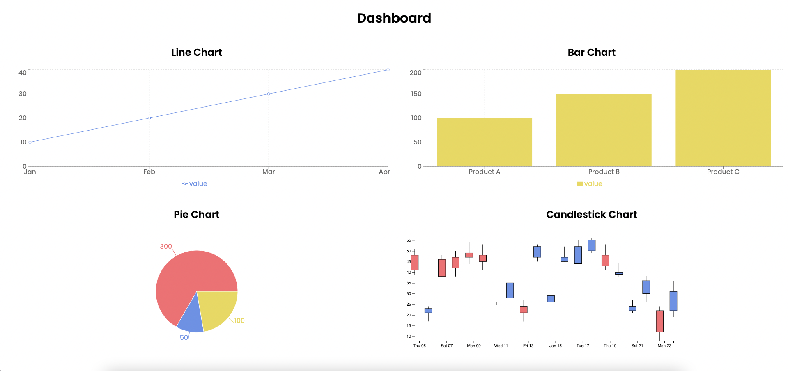

# Charts Dashboard Project
#### This project is a full-stack web application that displays multiple charts (Candlestick, Line, Bar, and Pie) on a dashboard. It uses Django for the backend (API) and Next.js with TypeScript for the frontend.



## Instructions on how to set up and run the app:
### 1. Backend:
a) Install the backend dependencies using the following command in terminal:
```bash
cd charts_web
cd mybackend
pip install -r requirements.txt
```
b) Run the Django server by following this command in terminal:
```bash
python3 manage.py runserver
```
c) Django server will be running at
```bash
http://localhost:8000/
```
d) And the API Endpoint, where the charts data is served at is:
```bash
http://localhost:8000/api/charts
```

### 2. Frontend:
a) Install the following dependencies using the commands below (Make sure you are in the charts_web directory):
```bash
npm install
```
b) Then, run the Next.js development server with:
```bash
npm run dev
```
c) The frontend will be available at:
```bash

The frontend will be available at http://localhost:3000/
```


## Libraries:
### Frontend:
1. Recharts for Line, Bar, and Pie charts
2. D3.js for the Candlestick chart
3. CSS Grid for 2x2 visualization
### Backend:
1. Django REST Framework for serving API data
2. datetime library for generating random candlestick data


## Brief Explanation on the design of project:

- The project uses a clear separation between the frontend (React/TypeScript) and backend (Django REST API). The frontend fetches data from the API, which will provide flexibility when in need of scaling.

- Data is fetched dynamically using the Fetch API within useEffect, allowing real-time data to populate the charts. Error handling is included to provide feedback in case of network failures.

- Recharts was chosen for its simplicity, making it ideal for rendering Line, Bar, and Pie charts. D3.js was used for the Candlestick chart.

- The useState hooks are used for managing data, ensuring that the data passed to the charts follows the expected data type.

- CSS Grid and Recharts' ResponsiveContainer were used to create a responsive 2x2 grid layout, ensuring the dashboard adapts to different screen sizes.
